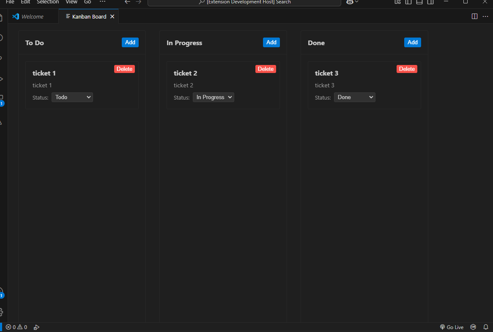

# TaskBoard for VS Code

A Visual Studio Code extension that provides a simple, efficient Kanban board for managing tasks directly within your editor. Perfect for developers who want to track their tasks without leaving VS Code.



## Features

### 🎯 Task Management
- Create, edit, and organize tasks in a Kanban-style board
- Drag-and-drop tasks between status columns
- Quick status updates via dropdown menu
- Automatic timestamp tracking for task creation and updates

### 📋 Board Organization
- Three-column layout:
  - To Do
  - In Progress
  - Done
- Clean, VS Code-native interface
- Persistent board state

### 💾 Data Storage
- Support for both JSON and CSV file formats
- Auto-save functionality
- File watching for real-time updates
- Proper handling of special characters and formatting

## Getting Started

1. Open the Command Palette (`Cmd+Shift+P` / `Ctrl+Shift+P`)
2. Type "TaskBoard" to see available commands:
   - `TaskBoard: Create New Board` - Create a new board file
   - `TaskBoard: Open Board` - Open an existing board
   - `TaskBoard: Show Current Board` - Display the active board

## Using TaskBoard

### Creating a New Board
1. Open Command Palette
2. Select `TaskBoard: Create New Board`
3. Choose file format (JSON or CSV)
4. Select save location

### Managing Tasks
- **Create Task**: Click "Add" in any column
- **Move Task**: 
  - Drag and drop between columns, or
  - Use the status dropdown in the task
- **Delete Task**: Click the delete button on the task

### Auto-save
All changes are automatically saved to your board file. No manual saving required!

## File Formats

### JSON Format
```json
{
  "columns": [
    {
      "id": "todo",
      "name": "To Do",
      "tickets": [...]
    },
    {
      "id": "in-progress",
      "name": "In Progress",
      "tickets": [...]
    },
    {
      "id": "done",
      "name": "Done",
      "tickets": [...]
    }
  ]
}
```

### CSV Format
```csv
id,title,description,status,createdAt,updatedAt
ticket-1,Task 1,Description 1,todo,2024-03-19T10:00:00Z,2024-03-19T10:00:00Z
```

## Requirements

- Visual Studio Code version 1.87.0 or higher
- Node.js and npm (for development)

## Development

### Setup
```bash
git clone [repository-url]
cd taskboard
npm install
```

### Build
```bash
npm run compile
```

### Debug
1. Open in VS Code
2. Press F5 to start debugging
3. Use Command Palette to test commands

## Contributing

1. Fork the repository
2. Create your feature branch (`git checkout -b feature/amazing-feature`)
3. Commit your changes (`git commit -m 'Add some amazing feature'`)
4. Push to the branch (`git push origin feature/amazing-feature`)
5. Open a Pull Request

## License

[MIT License](LICENSE)

## Acknowledgments

- Built with React and TypeScript
- Uses react-beautiful-dnd for drag-and-drop functionality
- Inspired by Kanban methodology
